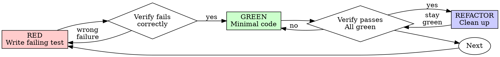

# Test-Driven Development (TDD)

## Overview

Write the test first. Watch it fail. Write minimal code to pass.

**Core principle:** If you didn't watch the test fail, you don't know if it tests the right thing.

**Violating the letter of the rules is violating the spirit of the rules.**

## Related Documentation

- For principles on writing clean, readable, and deterministic tests (such as Arrange-Act-Assert structure, avoiding logic in tests, and DAMP test design), refer to [typescript-testing](../typescript-testing/SKILL.md).
- For common testing pitfalls and mocking guidelines, refer to [testing-anti-patterns.md](./testing-anti-patterns.md).

## When to Use

- **Implementing New Features:** Write tests defining the expected behavior before writing any code.
- **Bug Fixes:** Write a failing test that reproduces the bug before fixing it.
- **Refactoring:** Keep tests green during code cleanup and reorganization.
- **Behavioral Changes:** Modify tests first to match the new behavior requirements.

## When NOT to Use

- **Throwaway Prototypes:** Spikes or pure exploration where the code will be discarded (TDD must be used when rewriting the real implementation).
- **Non-Logical Files:** Writing static configuration files (e.g., config, JSON files, package.json) or documentation.
- **Pure Code Generation:** Outputting boilerplate generated entirely by external tools where no manual implementation is required.

Thinking "skip TDD just this once"? Stop. That's rationalization.

## The Iron Law

```
NO PRODUCTION CODE WITHOUT A FAILING TEST FIRST
```

Write code before the test? Delete it. Start over.

**No exceptions:**
- Don't keep it as "reference"
- Don't "adapt" it while writing tests
- Don't look at it
- Delete means delete

Implement fresh from tests. Period.

## Red-Green-Refactor



### RED - Write Failing Test

Write one minimal test showing what should happen. 

> [!NOTE]
> For concrete examples of Good and Bad test setups, refer to [samples/retry-operation.test.ts](./samples/retry-operation.test.ts).

**Requirements:**
- One behavior
- Clear name
- Real code (no mocks unless unavoidable)

### Verify RED - Watch It Fail

**MANDATORY. Never skip.**

```bash
npm test path/to/test.test.ts
```

Confirm:
- Test fails (not errors)
- Failure message is expected
- Fails because feature missing (not typos)

**Test passes?** You're testing existing behavior. Fix test.

**Test errors?** Fix error, re-run until it fails correctly.

### GREEN - Minimal Code

Write simplest code to pass the test.

> [!NOTE]
> For concrete examples of Good and Bad minimal implementations, refer to [samples/retry-operation.ts](./samples/retry-operation.ts).

Don't add features, refactor other code, or "improve" beyond the test.

### Verify GREEN - Watch It Pass

**MANDATORY.**

```bash
npm test path/to/test.test.ts
```

Confirm:
- Test passes
- Other tests still pass
- Output pristine (no errors, warnings)

**Test fails?** Fix code, not test.

**Other tests fail?** Fix now.

### REFACTOR - Clean Up

After green only:
- Remove duplication
- Improve names
- Extract helpers

Keep tests green. Don't add behavior.

### Repeat

Next failing test for next feature.

## TDD Across Testing Levels

Apply the Red-Green-Refactor cycle at the appropriate level. Use the following guide for different testing levels:

### 1. Unit Tests (Fastest Loop)
- **Target**: Pure functions, helper utilities, state managers, and individual logic modules.
- **TDD Flow**: Extremely fast feedback loop (seconds).
- **Mocking**: Mock slow or non-deterministic external boundaries (e.g., database queries, network requests, third-party APIs) to keep tests fast and deterministic. Avoid mocking internal application logic.
- **Tool**: The configured unit testing runner.

### 2. Integration Tests (Component & Flow Level)
- **Target**: UI components, server routes, API endpoints, or multi-step service coordinators.
- **TDD Flow**: Verify that integrated units collaborate correctly (e.g., a component triggering a utility and updating state).
- **Mocking**: Minimize mocks. Do not mock internal child components or helpers unless they have heavy side effects or network requests.
- **Tool**: The configured integration/component testing framework.

### 3. E2E / Acceptance Tests (User Journeys)
- **Target**: Complete end-to-end user journeys and high-level workflows.
- **Double-Loop TDD**:
  1. **Outer Loop (Acceptance)**: Write a failing high-level integration/E2E test defining the feature requirement (**RED**).
  2. **Inner Loop (TDD)**: To make it pass, step down and write Unit/Integration tests for individual modules, code them to pass, and refactor (**RED-GREEN-REFACTOR**).
  3. **Complete**: Once all inner loops pass, verify the outer loop turns **GREEN**.

## Good Tests

| Quality | Good | Bad |
|---------|------|-----|
| **Minimal** | One thing. "and" in name? Split it. | `test('validates email and domain and whitespace')` |
| **Clear** | Name describes behavior | `test('test1')` |
| **Shows intent** | Demonstrates desired API | Obscures what code should do |

## Why Order Matters

**"I'll write tests after to verify it works"**

Tests written after code pass immediately. Passing immediately proves nothing:
- Might test wrong thing
- Might test implementation, not behavior
- Might miss edge cases you forgot
- You never saw it catch the bug

Test-first forces you to see the test fail, proving it actually tests something.

**"I already manually tested all the edge cases"**

Manual testing is ad-hoc. You think you tested everything but:
- No record of what you tested
- Can't re-run when code changes
- Easy to forget cases under pressure
- "It worked when I tried it" ≠ comprehensive

Automated tests are systematic. They run the same way every time.

**"Deleting X hours of work is wasteful"**

Sunk cost fallacy. The time is already gone. Your choice now:
- Delete and rewrite with TDD (X more hours, high confidence)
- Keep it and add tests after (30 min, low confidence, likely bugs)

The "waste" is keeping code you can't trust. Working code without real tests is technical debt.

**"TDD is dogmatic, being pragmatic means adapting"**

TDD IS pragmatic:
- Finds bugs before commit (faster than debugging after)
- Prevents regressions (tests catch breaks immediately)
- Documents behavior (tests show how to use code)
- Enables refactoring (change freely, tests catch breaks)

"Pragmatic" shortcuts = debugging in production = slower.

**"Tests after achieve the same goals - it's spirit not ritual"**

No. Tests-after answer "What does this do?" Tests-first answer "What should this do?"

Tests-after are biased by your implementation. You test what you built, not what's required. You verify remembered edge cases, not discovered ones.

Tests-first force edge case discovery before implementing. Tests-after verify you remembered everything (you didn't).

30 minutes of tests after ≠ TDD. You get coverage, lose proof tests work.

## Common Rationalizations

| Excuse | Reality |
|--------|---------|
| "Too simple to test" | Simple code breaks. Test takes 30 seconds. |
| "I'll test after" | Tests passing immediately prove nothing. |
| "Tests after achieve same goals" | Tests-after = "what does this do?" Tests-first = "what should this do?" |
| "Already manually tested" | Ad-hoc ≠ systematic. No record, can't re-run. |
| "Deleting X hours is wasteful" | Sunk cost fallacy. Keeping unverified code is technical debt. |
| "Keep as reference, write tests first" | You'll adapt it. That's testing after. Delete means delete. |
| "Need to explore first" | Fine. Throw away exploration, start with TDD. |
| "Test hard = design unclear" | Listen to test. Hard to test = hard to use. |
| "TDD will slow me down" | TDD faster than debugging. Pragmatic = test-first. |
| "Manual test faster" | Manual doesn't prove edge cases. You'll re-test every change. |
| "Existing code has no tests" | You're improving it. Add tests for existing code. |

## Red Flags - STOP and Start Over

- Code before test
- Test after implementation
- Test passes immediately
- Can't explain why test failed
- Tests added "later"
- Rationalizing "just this once"
- "I already manually tested it"
- "Tests after achieve the same purpose"
- "It's about spirit not ritual"
- "Keep as reference" or "adapt existing code"
- "Already spent X hours, deleting is wasteful"
- "TDD is dogmatic, I'm being pragmatic"
- "This is different because..."

**All of these mean: Delete code. Start over with TDD.**

## Example: Bug Fix

**Bug:** Empty email accepted

For full example code, refer to:
- RED (Failing Test): [samples/submit-form.test.ts](./samples/submit-form.test.ts)
- GREEN (Passing Implementation): [samples/submit-form.ts](./samples/submit-form.ts)

**Verify RED**
```bash
$ npm test
FAIL: expected 'Email required', got undefined
```

**Verify GREEN**
```bash
$ npm test
PASS
```

**REFACTOR**
Extract validation for multiple fields if needed.

## Verification Checklist

Before marking work complete:

- [ ] Every new function/method has a test
- [ ] Watched each test fail before implementing
- [ ] Each test failed for expected reason (feature missing, not typo)
- [ ] Wrote minimal code to pass each test
- [ ] All tests pass
- [ ] Output pristine (no errors, warnings)
- [ ] Tests use real code (mocks only if unavoidable)
- [ ] Edge cases and errors covered

Can't check all boxes? You skipped TDD. Start over.

## When Stuck

| Problem | Solution |
|---------|----------|
| Don't know how to test | Write wished-for API. Write assertion first. Ask your human partner. |
| Test too complicated | Design too complicated. Simplify interface. |
| Must mock everything | Code too coupled. Use dependency injection. |
| Test setup huge | Extract helpers. Still complex? Simplify design. |

## Debugging Integration

Bug found? Write failing test reproducing it. Follow TDD cycle. Test proves fix and prevents regression.

Never fix bugs without a test.

## Related Documentation & Skills

When adding mocks or test utilities, read [testing-anti-patterns.md](./testing-anti-patterns.md) to avoid common pitfalls:
- Testing mock behavior instead of real behavior
- Adding test-only methods to production classes
- Mocking without understanding dependencies

For related architectural patterns and development standards in this workspace:
- For general code quality, SOLID principles, and refactoring guidelines during the Refactor stage, refer to [typescript-architect](../typescript-architect/SKILL.md).
- For component composition, custom hooks, and state management in React, refer to [react-architecture](../react-architecture/SKILL.md).

## Final Rule

```
Production code → test exists and failed first
Otherwise → not TDD
```

No exceptions without your human partner's permission.
