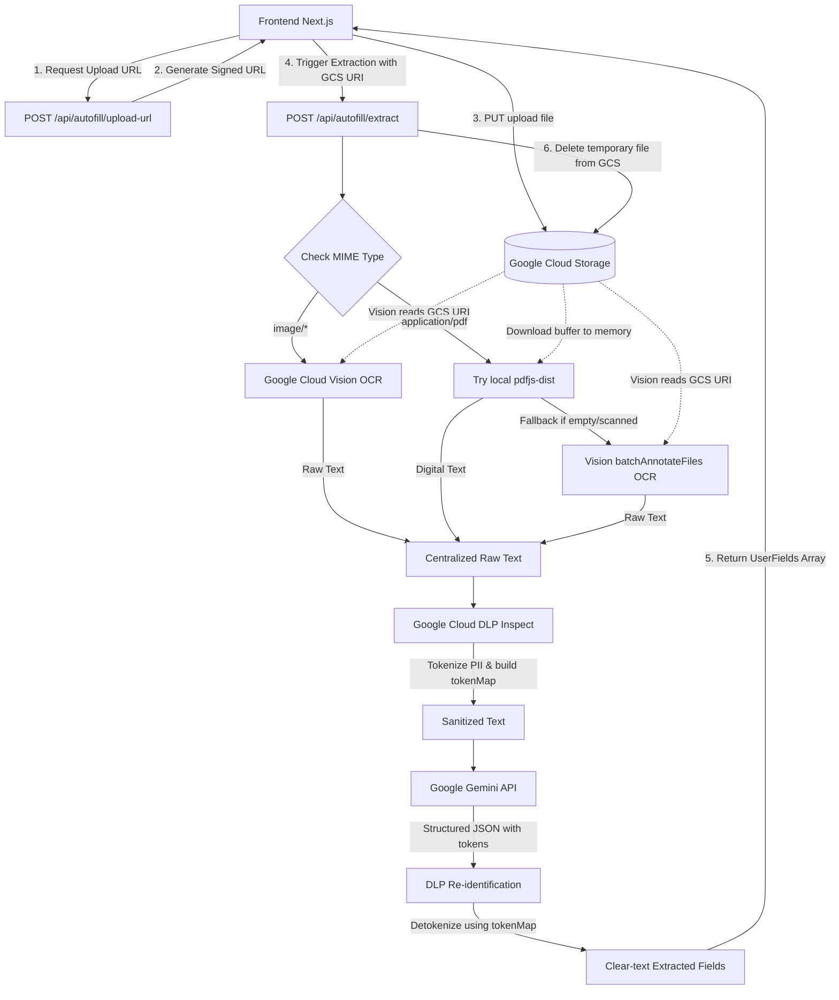

# Autofill System (v4) - Secure Hybrid Extraction & Mapping Pipeline

## 1. Overview
This document describes the production implementation of the Autofill System (V4) in the application. 

Building on the step-by-step wizard UI introduced in v3, version 4 transitions the data ingestion and security architecture to a production-ready, highly secure enterprise pipeline. V4 resolves Vercel's 4.5MB payload limits by executing Direct uploads to Google Cloud Storage (GCS) via Signed URLs. Furthermore, it integrates a hybrid text-extraction layer (local `pdfjs-dist` parsing with fallback to Google Cloud Vision API OCR) and enforces strict privacy controls through Google Cloud Data Loss Prevention (DLP) de-identification (tokenization) and re-identification (detokenization) before data is processed by the LLM (Gemini 3.5 Flash / `gemini-3-flash-preview`).

---

## 2. Architecture & Key Upgrades in V4

The active implementation in `app/features/autofill-wizard/v2` and `app/api/autofill` introduces the following major changes over prior versions:

### Key Upgrade Matrix:
*   **GCS Direct Uploads:** Replaces base64 payload forwarding with a secure pre-signed PUT request directly from the browser to Google Cloud Storage, bypassing server/Vercel size limitations.
*   **Hybrid Extraction Layer:** Optimizes resource usage by attempting local PDF parsing on digital PDFs first using `pdfjs-dist`. It falls back to GCS-based Google Cloud Vision API OCR for scanned PDFs or images.
*   **Privacy-Safe Processing (DLP):** Under `@google-cloud/dlp`, all extracted text is inspected for PII (names, phone numbers, addresses, emails, local European IDs like Spanish DNI/NIE, German Passport, etc.) and replaced with cryptographic-style tokens (e.g. `[PERSON_NAME_1]`) prior to sending text to the LLM.
*   **Structured JSON Output:** Uses the new `@google/genai` SDK and its `responseSchema` configuration to enforce deterministic JSON array outputs from Gemini.
*   **Temporary GCS Lifetime & Auto-Cleanup:** All uploaded files are immediately deleted from GCS in a `finally` block once extraction terminates.
*   **Fillable PDF Processing:** Interactive text fields, checkboxes, dropdowns, and radio groups are parsed and filled client-side/server-side using `pdf-lib`.

---

## 3. Data Architecture Diagram

The Autofill V4 pipeline consists of two phases: **Phase 1: Secure Supporting Document Extraction**, and **Phase 2: Form Mapping & PDF Generation**.

### Phase 1: Secure Supporting Document Extraction (PII-Safe)



### Phase 2: Form Mapping & PDF Generation

```mermaid
graph TD
    A[Frontend Next.js] -->|1. Parse interactive fields| B[pdfService: extractFormFields]
    A -->|2. Generate spatial markdown with markers| C[pdfService: generateMarkdownFromPdf]
    A -->|3. Request Mapping| D[POST /api/autofill/map-v3]
    
    D -->|Extracted Fields + Marked Markdown| E[Gemini 3.5 Flash]
    E -->|Match fields using index markers| F[Dotted Mappings JSON]
    F -->|4. Return FieldMapping[]| A
    
    A -->|5. Present Review UI & receive edits| G[Step 3 Review UI]
    G -->|6. Compile final values & fill PDF| H[pdfService: fillPdf]
    H -->|7. Generate local download URL| I[Step 4 Download UI]
```

---

## 4. Logical Processing Flow

### 1. Pre-Signed URL Generation
*   **Endpoint:** `POST /api/autofill/upload-url`
*   **File:** [`app/api/autofill/upload-url/route.ts`](file:///Users/fernandogonzalezrionda/Desktop/Projects/autofill/formsautofill/app/api/autofill/upload-url/route.ts)
*   **Logic:** Receives `filename` and `contentType`. Generates a unique path `uploads/${Date.now()}-${uuid}-${filename}` and creates a v4 pre-signed PUT URL using the Google Cloud Storage SDK with an expiration time of 15 minutes. It returns both the `signedUrl` (for client uploading) and the internal `gcsUri` (e.g. `gs://bucket-name/uploads/...`).

### 2. Hybrid Data Extraction
*   **Endpoint:** `POST /api/autofill/extract`
*   **File:** [`app/api/autofill/extract/route.ts`](file:///Users/fernandogonzalezrionda/Desktop/Projects/autofill/formsautofill/app/api/autofill/extract/route.ts)
*   **Logic:**
    1.  **MIME Type Dispatching:**
        *   **Images (`image/*`):** Passes the `gcsUri` directly to the Google Cloud Vision client's `textDetection` method.
        *   **PDFs (`application/pdf`):** Downloads the file buffer in memory and runs local `pdfjs-dist` text parsing. If the extracted text is empty or shorter than 50 characters (indicating a scanned document), it falls back to Google Cloud Vision API's `batchAnnotateFiles` to OCR up to 5 pages.
    2.  **DLP De-identification:** The raw text is passed to `deidentifyText` in [`app/shared/utils/dlp.ts`](file:///Users/fernandogonzalezrionda/Desktop/Projects/autofill/formsautofill/app/shared/utils/dlp.ts). The DLP client inspects the content against a robust array of global and European PII types (e.g., `PERSON_NAME`, `EMAIL_ADDRESS`, `PHONE_NUMBER`, `IBAN_CODE`, `SPAIN_DNI`, `FRANCE_NIR`, etc.). Found PII instances are replaced with sequential tokens like `[PERSON_NAME_1]`, producing a mapped database (`tokenMap`) and `deidentifiedText`.
    3.  **Gemini Parsing:** The `deidentifiedText` and extraction instructions are sent to Gemini. Using `responseSchema` constraints, Gemini extracts fields into a rigid JSON structure containing keys and tokenized values.
    4.  **DLP Re-identification:** Values are restored to clear text using `reidentifyText(value, tokenMap)` before sending the results back to the client.
    5.  **GCS Cleanup:** The `finally` block ensures that `storage.bucket().file().delete()` is executed, wiping the temporary file from GCS storage.

### 3. Spatial Markdown Mapping
*   **Endpoint:** `POST /api/autofill/map-v3`
*   **File:** [`app/api/autofill/map-v3/route.ts`](file:///Users/fernandogonzalezrionda/Desktop/Projects/autofill/formsautofill/app/api/autofill/map-v3/route.ts)
*   **Logic:** 
    1.  The client parses the uploaded PDF layout and interactive fields.
    2.  Using a coordinate sorting mechanism (top-to-bottom, left-to-right), the client inserts bracketed index markers (e.g. `[0] Name:`, `[1] Age:`) into a structural Markdown document.
    3.  The client calls `/api/autofill/map-v3` sending the spatial Markdown, PDF fields definition, and the extracted data fields.
    4.  Gemini uses visual-textual context from the Markdown to align the extracted keys/values with the numbered input markers, returning a highly accurate mapping mapping array (handling text inputs, checkboxes, dropdowns with validation, and radio groups with option mapping).

*(Note: The visual mapping endpoint `POST /api/autofill/map` in [`app/api/autofill/map/route.ts`](file:///Users/fernandogonzalezrionda/Desktop/Projects/autofill/formsautofill/app/api/autofill/map/route.ts) remains in the codebase as a legacy/visual alternative, which renders red labels on a PDF image and passes the base64 media context to Gemini).*

### 4. Client-side PDF Filling
*   **Helper:** `fillPdf`
*   **File:** [`app/features/autofill-v2/services/pdfService.ts`](file:///Users/fernandogonzalezrionda/Desktop/Projects/autofill/formsautofill/app/features/autofill-v2/services/pdfService.ts)
*   **Logic:** Receives the original PDF file and the reviewed `FieldMapping[]`. Loads the PDF through `pdf-lib` and updates the interactive Acrobat Form (AcroForm) fields. Text fields are filled, checkboxes checked or unchecked (based on truthy evaluation), and dropdown/radio selections matched against valid options. A new `Uint8Array` is saved and downloaded by the user.

---

## 5. Node.js Libraries (`package.json`)

To run version 4 of the Autofill pipeline, the project relies on the following official dependencies:

*   **`@google/genai` (v1.41.0+):** The new Google Gen AI SDK used for structured JSON LLM output constraints.
*   **`@google-cloud/storage` (v7.7.0+):** Manages GCS Bucket uploads, pre-signed URL creation, document downloading, and object deletions.
*   **`@google-cloud/vision` (v4.1.0+):** Powers OCR text detection for images and scanned multi-page PDF documents.
*   **`@google-cloud/dlp` (v4.2.0+):** Handles sensitive data filtering, de-identification, and security scanning.
*   **`pdfjs-dist` (v5.7.284+):** Enables client-side and server-side text extraction and coordinates mapping of digital PDFs.
*   **`pdf-lib` (v1.17.1+):** Inspects, writes, and fills the form fields in the final PDF document.

---

## 6. Appendix: Google Cloud Console Setup

### Step 1: Enable APIs
In the Google Cloud Console, enable the following services:
*   Cloud Storage API
*   Cloud Vision API
*   Cloud Data Loss Prevention (DLP) API
*   Generative Language API (Gemini API)

### Step 2: Bucket Setup & CORS Configuration
Create a GCS bucket (default is `temporary-secure-uploads`). You must define a CORS policy on the bucket to allow Direct Uploads from your frontend origins.

Create a file named `cors.json`:
```json
[
  {
    "origin": ["http://localhost:3000", "http://localhost:3001", "https://your-domain.com"],
    "method": ["PUT", "OPTIONS"],
    "responseHeader": ["Content-Type"],
    "maxAgeSeconds": 3600
  }
]
```
Apply the CORS rules using the Cloud Shell / gcloud CLI:
```bash
gcloud storage buckets update gs://temporary-secure-uploads --cors-file=cors.json
```

### Step 3: Service Account Permissions
Create a Service Account to run the backend endpoints and assign the following IAM Roles:
*   **Storage Object Admin** (`roles/storage.objectAdmin`): To generate Signed URLs, download buffers, and delete temporary files.
*   **DLP User** (`roles/dlp.user`): To inspect, de-identify, and re-identify content.
*   **Cloud Vision API User** (`roles/vision.user`): To execute OCR on documents and images.

### Step 4: Environment Variables Setup
Generate a JSON key for the Service Account. In your deployment configuration or local `.env` file, set the following environment variables:

```ini
# GCS Configurations
GCS_BUCKET_NAME=temporary-secure-uploads
GOOGLE_PROJECT_ID=your-gcp-project-id

# Service Account credentials (can be raw JSON or Base64 encoded JSON string)
GOOGLE_CREDENTIALS_JSON={"type":"service_account",...}

# Gemini API Configurations
GEMINI_API_KEY=your-gemini-api-key
```
