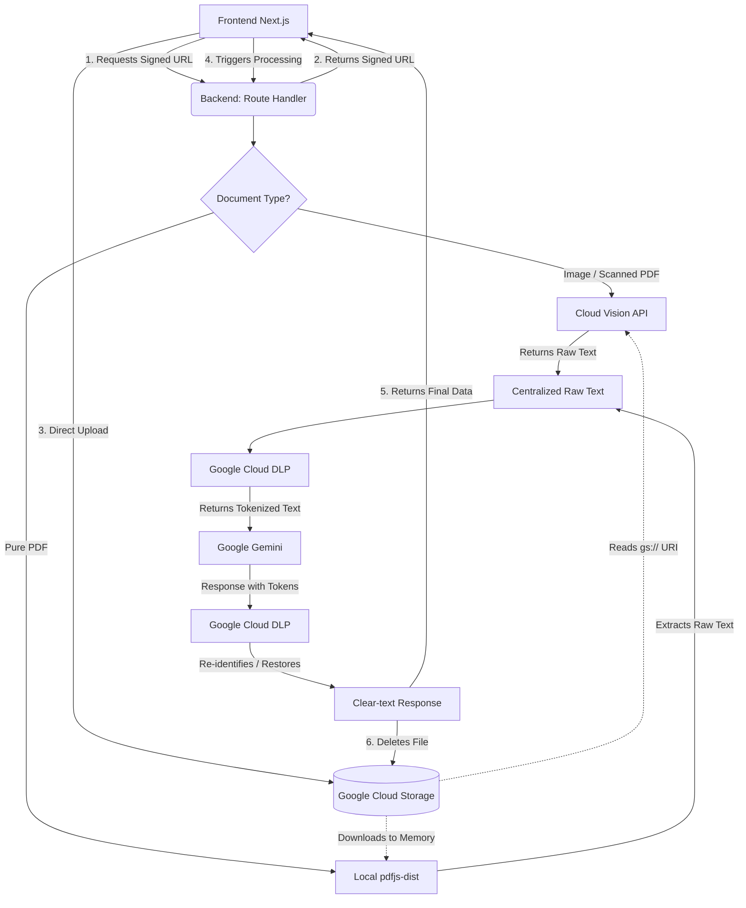

Perfecto. Al usar el **App Router** de Next.js (la carpeta `app`), aprovechamos al máximo los **Route Handlers** (`app/api/route.js` o `.ts`) o los **Server Actions** para generar las URL firmadas de forma segura y sin límites de tamaño de payload.

Aquí tienes el documento completo y actualizado (manteniendo el inglés que solicitaste en la versión anterior), eliminando todo rastro de `multer` e integrando el flujo profesional con **Google Cloud Storage**.

---

### Data Architecture Diagram (Next.js App Router & Cloud Storage)

---

### Logical Processing Flow

#### 1. IMAGES (or Scanned PDFs)

This flow applies to photos of ID cards, crumpled pay stubs, or documents without selectable text. It utilizes Direct Uploads to bypass Vercel's 4.5MB payload limit.

* **1.0 Request Upload URL:** The user selects a file on the frontend. The frontend calls a Next.js App Router endpoint (e.g., `POST /api/upload-url`) requesting permission to upload.
* **1.1 Generate Signed URL:** The backend uses the `@google-cloud/storage` SDK to generate a temporary, securely signed URL (valid for ~5 minutes) and returns it to the frontend.
* **1.2 Direct Upload:** The frontend uses the Signed URL to upload the file directly to a Google Cloud Storage bucket. Vercel never touches the file payload.
* **1.3 Trigger Processing:** Once the upload succeeds, the frontend calls the main processing endpoint (e.g., `POST /api/process-document`), passing the file's Cloud Storage URI (`gs://your-bucket/filename.jpg`).
* **1.4 OCR via Cloud Vision:** The backend passes the `gs://` URI directly to **Google Cloud Vision**. Vision reads the file from the bucket, extracts the text, and returns it as a String.
* **1.5 De-identification (DLP):** The backend sends that raw text to **Google Cloud DLP**. DLP detects sensitive entities, replaces them with tokens, and returns the sanitized text.
* **1.6 LLM Processing:** The backend sends the sanitized text and your prompt to **Google Gemini**.
* **1.7 Secure Response:** Gemini processes the query without seeing real data and returns a response using the tokens (e.g., *"The ID for [PERSON_NAME] is valid."*).
* **1.8 Re-identification (DLP):** The backend sends Gemini's response back to **Google Cloud DLP** to decrypt the tokens and restore the real data.
* **1.9 Cleanup:** The backend explicitly calls Google Cloud Storage to **delete the file** (`file.delete()`), ensuring no sensitive PII is left behind in the bucket.
* **1.10 Final Delivery:** The backend delivers the clear-text response back to the user on the frontend.

#### 2. PURE PDF (Selectable Text)

This flow handles standard digital PDFs, extracting text locally within the Vercel function without needing Cloud Vision.

* **2.0 Request & Upload:** Steps 1.0 to 1.3 are identical. The PDF is uploaded directly to Google Cloud Storage via a Signed URL.
* **2.1 Download to Memory:** The backend (Next.js Route Handler) downloads the PDF from the Cloud Storage bucket directly into a memory buffer (`file.download()`).
* **2.2 Local Extraction:** The backend uses **`pdfjs-dist`** on that memory buffer to parse the document and extract all structured text.
* **2.3 De-identification (DLP):** The backend sends the extracted text to **Google Cloud DLP** for tokenization.
* **2.4 LLM Processing:** The backend communicates with **Google Gemini**, sending the masked text.
* **2.5 Secure Response:** Gemini generates its response, including the tokens.
* **2.6 Re-identification (DLP):** The backend requests Re-identification from **Google Cloud DLP** to restore the information.
* **2.7 Cleanup:** The backend deletes the PDF from the Cloud Storage bucket to maintain strict privacy.
* **2.8 Final Delivery:** The backend sends the final result with original data back to the user.

---

### Node.js Libraries (`package.json`)

To implement this logic in your Next.js App Router project, you will need these official packages:

* **`@google-cloud/storage`**: To generate Signed URLs, read files, and delete them from the bucket.
* **`@google-cloud/vision`**: For text extraction (OCR) from images using `gs://` URIs.
* **`@google-cloud/dlp`**: For tokenization and re-identification of sensitive data.
* **`@google/generative-ai`**: The official SDK to communicate with Gemini.
* **`pdfjs-dist`**: To read and extract text from digital PDFs natively.

*(Note: `multer` is entirely removed as Vercel/Next.js App Router and Cloud Storage Direct Uploads make it obsolete and incompatible).*

---

### Appendix: Google Cloud Console Setup

To enable this architecture, you must prepare your Google Cloud environment to handle Storage alongside the ML APIs.

**Step 1: Create the Project and Enable APIs**

1. Go to the Google Cloud Console (console.cloud.google.com).
2. Create a new project (e.g., *my-secure-ai-app*).
3. Go to **APIs & Services** > **Library** and **Enable** these four APIs:
* *Cloud Storage API* (Often enabled by default)
* *Cloud Vision API*
* *Cloud Data Loss Prevention (DLP) API*
* *Generative Language API* (or Vertex AI API).

**Step 2: Create the Storage Bucket and Configure CORS**

1. Go to **Cloud Storage** > **Buckets** and click **Create**.
2. Name your bucket (e.g., `secure-uploads-bucket`), choose a region close to your users, and create it.
3. **Crucial for Next.js:** You must configure CORS (Cross-Origin Resource Sharing) on this bucket so the user's browser can upload files directly via the Signed URL. You can do this using the Google Cloud Shell by running:
`echo '[{"origin": ["http://localhost:3000", "https://your-production-domain.com"], "method": ["PUT", "OPTIONS"], "responseHeader": ["Content-Type"], "maxAgeSeconds": 3600}]' > cors.json`
Then apply it: `gcloud storage buckets update gs://secure-uploads-bucket --cors-file=cors.json`

**Step 3: Create Credentials (Service Account)**

1. Go to **APIs & Services** > **Credentials** > **Create Credentials** > **Service Account**.
2. Assign the following permissions so your Next.js backend has full operational rights:
* *Storage Object Admin* (Required to generate Signed URLs, read, and delete files)
* *Cloud Vision User*
* *DLP User*
* *Vertex AI User* (if applicable).

3. Save the service account.

**Step 4: Generate the Key and Connect Next.js**

1. Click on the service account > **Keys** > **Add Key** > **Create new key** (JSON format).
2. Download the JSON file.
3. Since you are deploying on Vercel, you cannot easily upload a physical JSON file. Instead, convert the contents of the JSON file into a single string (removing line breaks) or encode it in Base64.
4. Add it as an Environment Variable in Vercel (e.g., `GOOGLE_CREDENTIALS_JSON`).
5. In your Next.js Route Handlers, initialize the Google Cloud clients by parsing this environment variable directly, rather than relying on a file path.